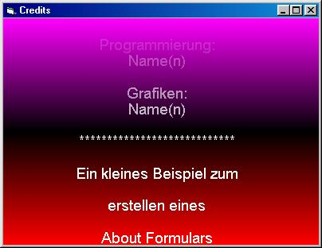



## Credits Demo

### Description

It's a demonstartion of a really great About formular. It has tranparent effects and scrolls to the top. It also has a gradient background.
 
### More Info
 
It doesn't run under W95 because it uses the API AlphaBlend.

             |
---                |---
**Submitted On**   |2003-05-16 12:03:02
**By**             |[Frank Maier](https://github.com/Planet-Source-Code/PSCIndex/blob/master/ByAuthor/frank-maier.md)
**Level**          |Intermediate
**User Rating**    |5.0 (15 globes from 3 users)
**Compatibility**  |VB 4\.0 \(32\-bit\), VB 5\.0, VB 6\.0
**Category**       |[Graphics](https://github.com/Planet-Source-Code/PSCIndex/blob/master/ByCategory/graphics__1-46.md)
**World**          |[Visual Basic](https://github.com/Planet-Source-Code/PSCIndex/blob/master/ByWorld/visual-basic.md)
**Archive File**   |[Credits\_De1588655162003\.zip](https://github.com/Planet-Source-Code/frank-maier-credits-demo__1-45528/archive/master.zip)

